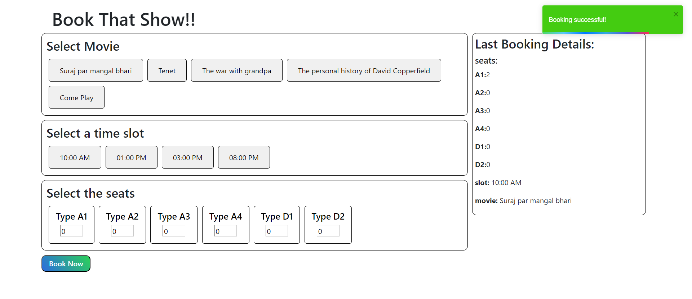

# BookMyShow Project

## Introduction

Welcome to the world of seamless movie ticket booking at your fingertips. Our web application, BookMyShow, revolutionizes the way you experience movies by allowing you to effortlessly reserve your seats online. Dive into the cinematic world with the convenience of browsing available movies, hand-picking your favorite film, selecting showtimes that suit your schedule, and securing your preferred seats.

A Fusion of Innovation and Reliability

At the heart of our project lies a unique blend of technology. We employ both local storage and MongoDB for data management. Local storage ensures your interactions with the platform are swift and responsive, while MongoDB stores your bookings securely for future reference.

Checkout web-app demo here - [BookMyShow](https://64fc7a68a1bc445f6faebfd9--clinquant-fenglisu-505a48.netlify.app/)

## Table of Contents

- [Introduction](#introduction)
- [Screenshot](#screenshot)
- [Technologies](#technologies)
- [Features](#features)
- [Getting Started](#getting-started)
- [Prerequisites](#prerequisites)
- [Installation](#installation)
- [Usage](#usage)
- [Contributing](#contributing)
- [License](#license)
- [Acknowledgements](#acknowledgements)

## Screenshot





## Technologies

- MongoDB for database
- Express.js node js framework
- React for frontend
- Node.js for backend

## Features

- Explore an extensive catalog of movies, each presented with its title and available showtimes.
- Handpick your preferred movie and access a detailed list of showtime options.
- Seamlessly reserve your desired seats for the selected showtime.
- Enjoy uninterrupted booking sessions with the power of local storage, ensuring your progress is saved even if you close the browser or refresh the page.
- Safeguard your completed bookings in MongoDB, providing a secure and permanent storage solution.
- Relive the magic of your last movie adventure with quick access to the details of your most recent booking.

## Getting Started

### Prerequisites

Before running the project, make sure you have the following prerequisites installed on your system:

- Node.js and npm: Install from [https://nodejs.org/](https://nodejs.org/)

## Installation

1. Clone the repository:

   ```bash
   git clone https://github.com/unkitsingh0/Almabetter_backend_bookmyshow_project
    cd your-project
    npm install
   ```

2. Set up the MongoDB connection:

   - Ensure you have MongoDB installed and running on your system.
   - Create a MongoDB database for the BookMyShow project and note down the connection string.

3. Configure the application:

   - Create a `.env` file in the root directory of the project.
   - Add the following environment variables to the `.env` file:

   ```
   PORT=8080                  # The port on which the application will run
   MONGODB_URI=your_mongodb_uri_here  # The MongoDB connection string
   ```

### Usage

1. Start the server:

   ```bash
   npm start

   ```

2. Open your web browser and point it to the BookMyShow application at `http://localhost:3000`.

3. Dive into the captivating world of cinema as you peruse a captivating array of available movies. Once you've made your selection, effortlessly access showtime details.

4. Time to set the stage! Choose your preferred showtime and secure the seats that suit your movie-going experience.

5. With the seats reserved, you're just a few steps away from movie magic. Simply follow the prompts to complete the booking process by providing the required information.

6. On the homepage, relish the convenience of quick access to the details of your most recent movie booking.

### Contributing

We embrace contributions from our community of enthusiasts! If you're eager to contribute to our project, we'd appreciate it greatly. Just adhere to these guidelines:

```markdown
## Contributing

- Fork the repository.
- Create a new branch for your feature/bug fix.
- Make your changes and test thoroughly.
- Create a pull request with a clear description of your changes.
```

## Contributions

This project was conceived, designed, and implemented by Ankit Singh. As the sole author and developer, I have crafted every aspect of this project, from inception to completion.

While this project was created independently, I appreciate your interest and encourage you to explore and use it. If you have any questions, feedback, or suggestions, please feel free to reach out.

Thank you for checking out my work!

## License

This project is open source and is available under the [MIT License](LICENSE). The MIT License is a permissive open-source license that allows you to use, modify, and distribute this software for free, provided you include the original copyright notice and disclaimers.
For more details, please read the [LICENSE](LICENSE) file.

## Acknowledgements

This project makes use of several open-source libraries and packages to enhance its functionality:

1. Frontend dependency or package

- **axios** - A promise-based HTTP client for making requests to your server or external APIs.

- **bootstrap** - A popular CSS framework for responsive and stylish web design.

- **react** - A JavaScript library for building user interfaces.

- **redux** - A predictable state container for managing the application's global state.

- **react-loader-spinner** - A React component for displaying loading spinners.

- **react-redux** - The official React bindings for Redux, enabling state management in React applications.

- **react-toastify** - A library for displaying notifications and toasts in your application.

2. Backend dependency or package

- **Express** - A fast, unopinionated, and minimalist web framework for Node.js.

- **Mongoose** - An elegant MongoDB object modeling tool that simplifies interactions with MongoDB databases.

- **MongoDB** - A popular NoSQL database for storing and managing your application's data.

- **body-parser** - Middleware for parsing incoming request bodies in Express applications.

- **cors** - Middleware for handling Cross-Origin Resource Sharing (CORS) in Express.

- **dotenv** - A zero-dependency module for loading environment variables from a `.env` file.

- **swagger-jsdoc** - A tool for generating Swagger/OpenAPI documentation from JSDoc comments.

- **swagger-ui-express** - Middleware for serving Swagger UI for your API documentation in Express.

These libraries and packages have played an integral role in the development of this project. We extend our gratitude to their creators and maintainers for their valuable contributions to the open-source community, enabling us to build robust and efficient Node.js applications.

---

You're most welcome to BookMyShow! Should you have any inquiries or require additional support, please don't hesitate to get in touch with us or raise an issue within the repository. We're here to ensure your movie booking experience is nothing short of delightful! Enjoy your cinematic journey!
